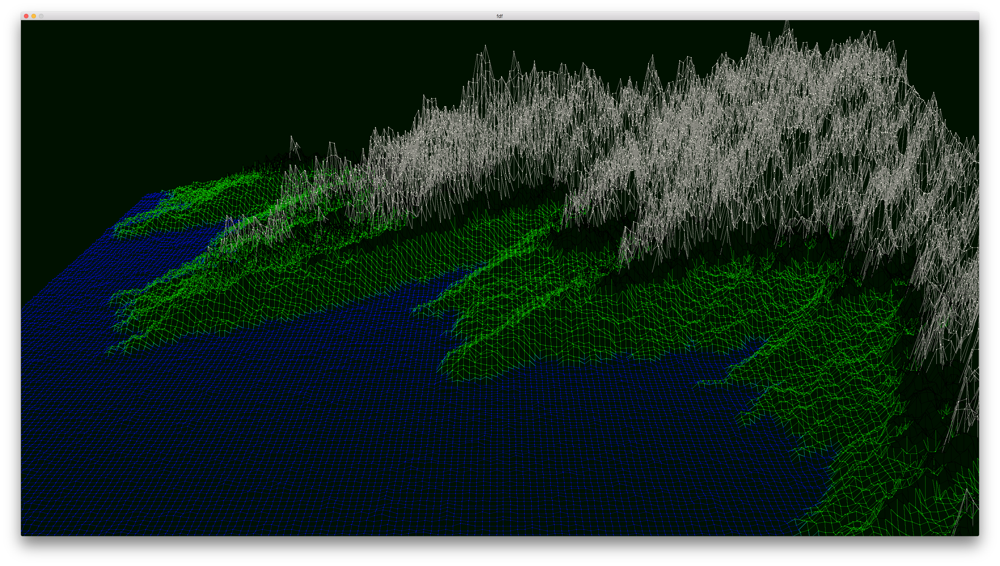
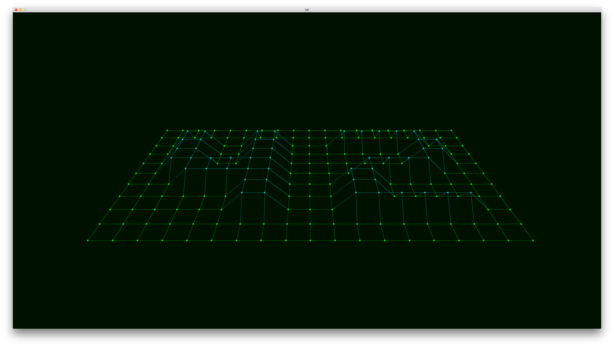

# fdf

  

take a .fdf file that define a rectangular with z ordinates and display it using a perpective projection
if an hexadecimal number is given after the z ordinate, it set the color, otherwise, the color is set by altitude.

example : 

      0  0  0  0  0  0  0  0  0  0  0  0  0  0  0  0  0  0  0
      0  0  0  0  0  0  0  0  0  0  0  0  0  0  0  0  0  0  0
      0  0 10 10  0  0 10 10  0  0  0 10 10 10 10 10  0  0  0
      0  0 10 10  0  0 10 10  0  0  0  0  0  0  0 10 10  0  0
      0  0 10 10  0  0 10 10  0  0  0  0  0  0  0 10 10  0  0
      0  0 10 10 10 10 10 10  0  0  0  0 10 10 10 10  0  0  0
      0  0  0 10 10 10 10 10  0  0  0 10 10  0  0  0  0  0  0
      0  0  0  0  0  0 10 10  0  0  0 10 10  0  0  0  0  0  0
      0  0  0  0  0  0 10 10  0  0  0 10 10 10 10 10 10  0  0
      0  0  0  0  0  0  0  0  0  0  0  0  0  0  0  0  0  0  0
      0  0  0  0  0  0  0  0  0  0  0  0  0  0  0  0  0  0  0

  

